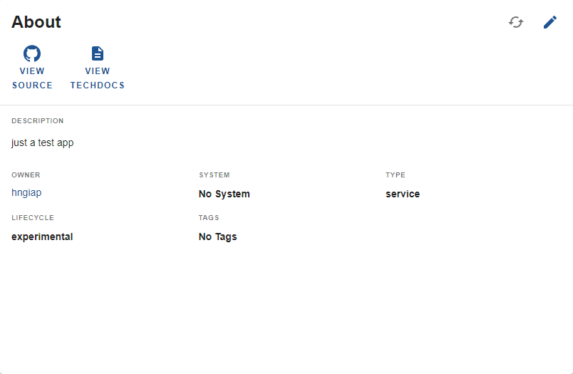
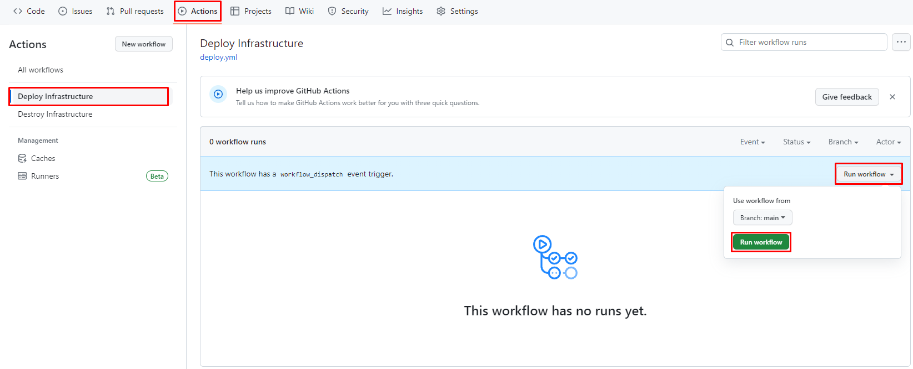
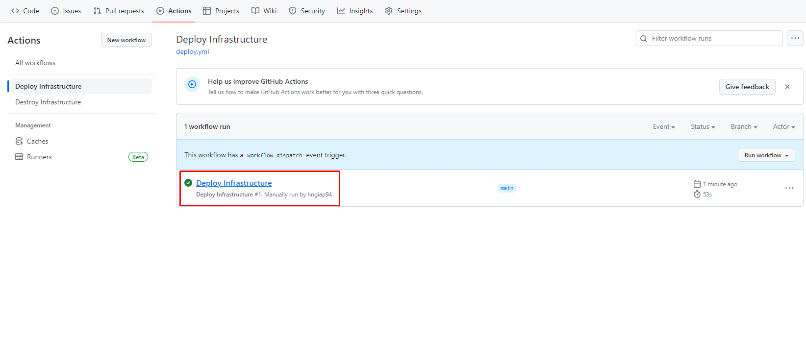

# How to deploy application

## Steps

1. Open github repository

- From **'OVERVIEW'** click on **'VIEW SOURCE'**.

2. Run github actions workflow

- Click on **'Actions'**

- Choose **'Deploy Infrastructure'** workflow

- Extend **'Run workflow'** dropdown and click on **'Run workflow'**

3. Verification

- Verify that workflow status is success

